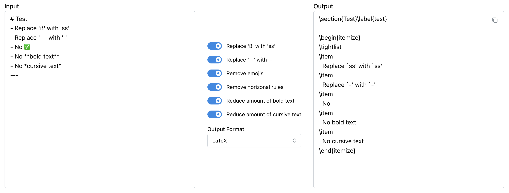

# DeLLMize

Refine and clean up LLM outputs automatically.
DeLLMize is a lightweight web app that lets you paste in Markdown text, removes common 'LLM quirks' and lets you export to multiple formats.

## Features

- Automatic processing (remove emojis, replace em-dashes, fix ß → ss, reduce bold/italic, etc.)
- Export to Markdown, LaTeX, Typst, HTML, RTF, and more
- Light/Dark theme toggle
- Powered by [Pandoc WebAssembly](https://github.com/tweag/pandoc-wasm)

## Preview

[Try it out!](https://marcow03.github.io/dellmize)
